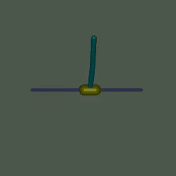

# Balancing Act: Mastering the Inverted Double Pendulum with Soft Actor-Critic

 

    
     
 

The inverted double pendulum is a hallmark of control theory, renowned for its instability and nonlinear dynamics. This project explores the challenge of stabilizing this system using the Soft Actor-Critic (SAC) algorithm, a state-of-the-art reinforcement learning method, within the MuJoCo physics engine. Through empirical experimentation, we harness SAC to develop a robust control strategy that balances the double pendulum upright with minimal torque, effectively navigating its complex behavior. Simulation results highlight SAC’s capability to adaptively learn policies for this demanding task, offering practical insights into its application for continuous control problems. This project demonstrates the power of SAC in addressing intricate dynamical systems and contributes to the growing field of reinforcement learning in control theory.

## Experiment

Play around with [this notebook](https://github.com/reshalfahsi/inverted-double-pendulum-sac/blob/master/Inverted_Double_Pendulum_SAC.ipynb) to gain knowledge of balancing the inverted double pendulum with SAC.

## Result

## Reward Curve

    The green line denotes rewards and the blue line indicates the best moving average. The best-moving average is gathered by applying an arithmetic mean to the reward that is better than the current best-moving average. 

## Qualitative Result

    These are the evolution of the control of the inverted double pendulum. The control is progressively better. 

<table>
    <tr>
        <td> 
            
            Episode 0
        </td>
        <td> 
            
            Episode 400
        </td>
        <td> 
            
            Final Episode
        </td>
    </tr>
</table>

## Credit

- [Neuronlike adaptive elements that can solve difficult learning control problems](https://ieeexplore.ieee.org/document/6313077)
- [Soft Actor-Critic: Off-Policy Maximum Entropy Deep Reinforcement Learning with a Stochastic Actor](https://arxiv.org/pdf/1801.01290)
- [Soft Actor-Critic](https://spinningup.openai.com/en/latest/algorithms/sac.html)
- [[gymnasium / mujoco] colaboratory で "HalfCheetah-v5" を動かそうとして FatalError: gladLoadGL error が発生したときの対策](https://qiita.com/siruku6/items/7545751b6f4d240427f6)
- [Inverted Double Pendulum](https://gymnasium.farama.org/environments/mujoco/inverted_double_pendulum/)
- [PyTorch Lightning](https://lightning.ai/docs/pytorch/latest/)
